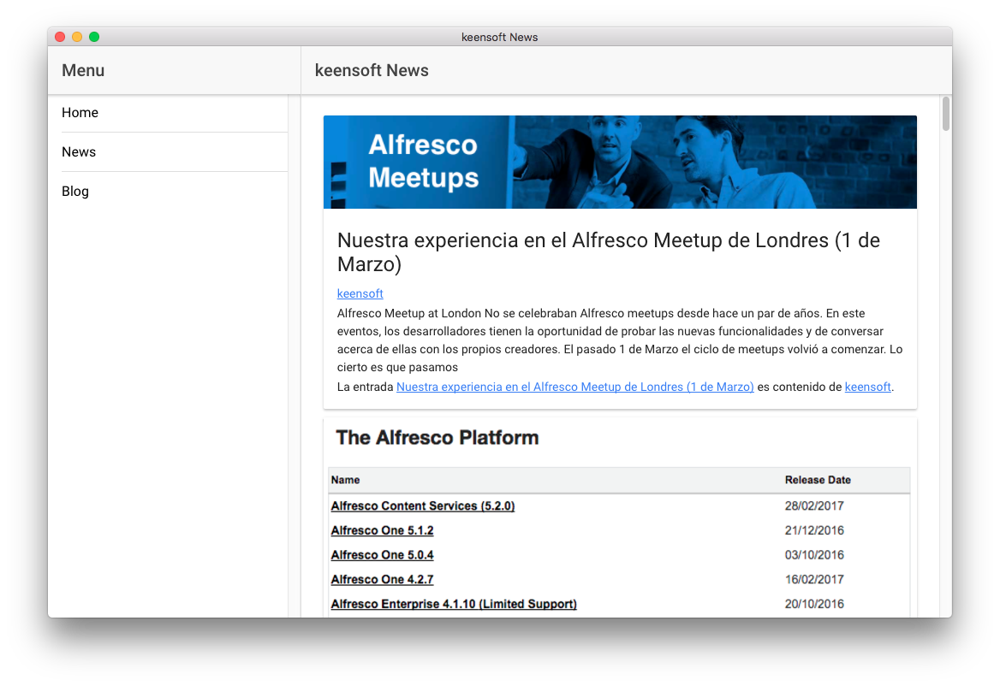
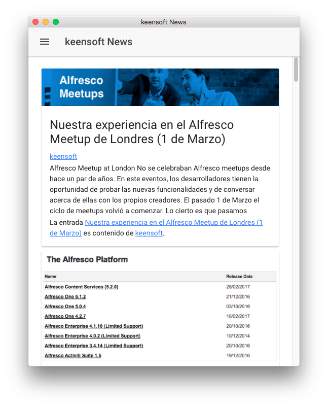

# keensoft fork
## Screenshots

## Hack
App connect with 2 feed sources and display content. User can open external native window to view complete post.

App uses IONIC split-pane, doing responsive layout! 

# Polyonic v0.0.4

## The ultimate "Universal App"

> Now using the latest Ionic 2.2.0 release :tada:

> This was created from Paul Sutherland's Polyonic project, but has since merged off into its own codebase.

#### Build once using web technologies and deploy everywhere!

An Electron Ionic application shell for creating Web Apps, Progressive Mobile Web Apps, Native Mobile Apps and Desktop Apps.

This project combines the <a href="http://electron.atom.io/">Electron Framework</a> with <a href="http://ionicframework.com/docs/v2/">Ionic 2</a> and provides a starter for building out an app that can run on either the desktop (macOS, Windows and Linux), a browser or mobile devices (iOS, Android and Windows Phone).  You can use this application to build and run on one or even all of these platforms.

# How Does It Work?

Polyonic only makes *minimal* changes to your Ionic project. We add a couple of files (they are ignored on mobile platforms, so there's no extra bulk), update a setting, and ask you to put your ionic project **inside** of the polyonic shell.

Your development for mobile stays the same, and we provide a few extra commands and a way to kickstart the desktop version of your app!

Here's what it looks like side by side with your app in Cordova:

# Electrolyte

The second piece to these projects is Electrolyte, my shim for Cordova plugins so that the native features available on desktop and mobile can work with minimal changes (if any) to your codebase. 

# Getting Started

1) Clone this repo

2) Overwrite the contents of the 'src' directory with the contents in the root directory of your ionic app

3) Run `npm run create` to copy the new build tools in and modify your package.json for electron

4) Run `npm run dev` to boot up your ionic app, the electron app, and start the live reload

# Building

Once you're ready to test out your app in a contained build just run `gulp build` and watch the magic happen. The build will create a binary for your current platform and architecture and place it in the `output` directory.

# Credits

This application was built using the <a href="https://github.com/szwacz/electron-boilerplate/blob/master/README.md">Electron Boilerplate Project</a> for scaffolding out the Electron application, the <a href="http://electron.atom.io/">Electron Framework</a> for creating desktop apps and <a href="http://ionicframework.com/">Ionic 2</a> for the UI and creating Native Mobile Applications, Progressive Mobile Web Applications and Web Applications. The original <a href="https://github.com/paulsutherland/Polyonic">polyonic</a> repo that helped kick start this.

# Todo

- Create a standardized CLI format for commands
- Clean up some other Electron Boilerplate code that we don't need
- Beef up the build process to configure the binaries for each platform with a universal set of settings
- More testing on other platforms. This is actively developed on MacOS
- Find ways to make the binaries smaller
- Expose the config variables to the Ionic app (or if Ionic does their own, work with that)

# Other, don't pay attention to this...

Test command for packaging:

 electron-packager build test --overwrite
